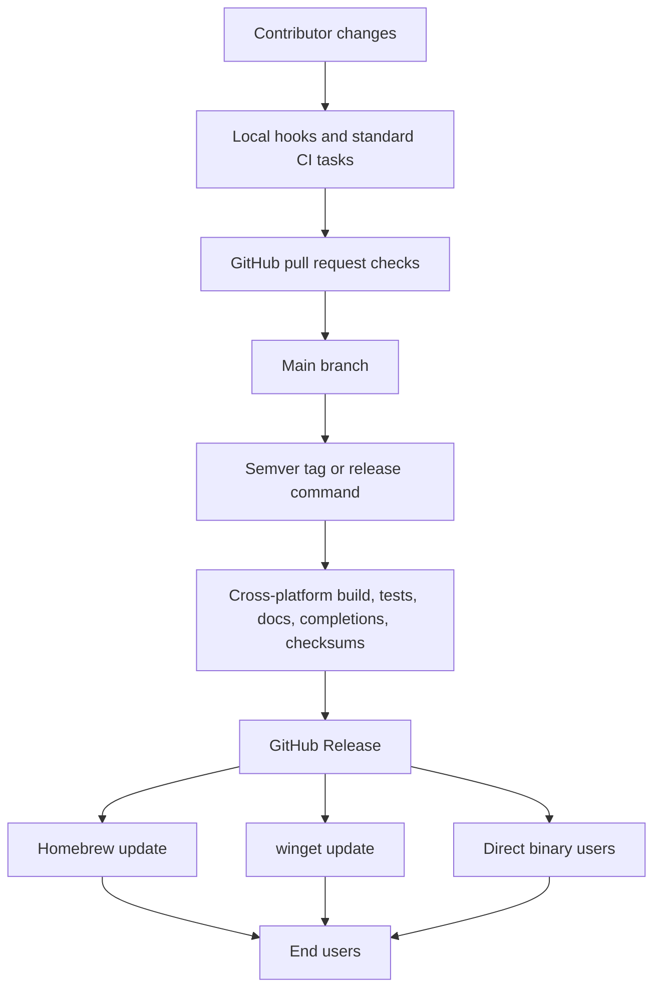

# Beehiiv CLI Open Source Maturity

## Problem Frame
The current codebase already has real substance: `cmd/beehiiv/main.go` boots a working Go CLI, `internal/commandset/operations.json` embeds 71 Beehiiv API operations, unit tests currently pass, and the tool already supports JSON-first output, pagination, and rate limiting. That makes this a good candidate for open-sourcing.

The maturity gap is around the public CLI and repository surface, not basic existence. The current workspace has no visible `.github/` or `.githooks/` structure, no release/distribution automation, no generated completions or command docs, and no version/build metadata flow. The CLI also currently uses a custom parser in `internal/cli/app.go`, stores credentials in a plaintext `.env` model by default, and exposes live credentials via `auth current`, which is too raw for a polished public launch.

The goal is to turn this into a public, cross-platform GitHub project that feels intentionally designed and maintainable, closer in maturity to reference CLIs such as `gh`, `stripe-cli`, and `gogcli`, while still remaining focused on Beehiiv rather than copying those tools wholesale.

## Release Flow

## Requirements

**Repository Foundation**
- R1. The public repository must include first-class open-source project surfaces: license, contribution guidance, code of conduct, security policy, issue templates, and pull request guidance.
- R2. The repository must include maintainership and automation metadata appropriate for a public GitHub project, such as dependency update automation, ownership/review conventions where applicable, and cross-platform editor or line-ending hygiene.
- R3. The repository must provide a documented contributor workflow with standardized local tasks and optional git hooks for formatting, linting, testing, and generated artifact refreshes.

**CLI Architecture and UX**
- R4. The CLI must be replatformed onto `spf13/cobra` using standard root and subcommand organization, built-in help/version/completion behavior, and centralized error handling instead of the current custom parser architecture.
- R5. The project may make breaking naming, command, flag, output, and module-path cleanups before the first public release; once the public `v1` surface is defined, it becomes the stable contract.
- R6. The public command surface must be hybrid: broad generated Beehiiv API coverage remains available, but common workflows get curated, hand-designed commands or aliases so the tool does not feel like a thin raw endpoint wrapper.
- R7. JSON-first scripting must remain a first-class use case, while interactive help, table output, examples, and command discoverability become substantially more polished.
- R8. The CLI must ship a standard version surface plus generated shell completions for Bash, Zsh, Fish, and PowerShell, all derived from the Cobra command tree.
- R9. The project must generate publishable command reference docs and manpages from the same Cobra command tree used at runtime so docs and shipped behavior do not drift.
- R10. The internal architecture must be refactored into clearer subsystems with explicit responsibilities for command wiring, generated API coverage, curated workflows, auth/secrets/config, output formatting, client runtime, and build/version metadata.

**Security and Configuration**
- R11. Credential storage must use the OS keychain or keyring by default when available, while still supporting environment-variable-based auth for CI, scripting, and other headless workflows.
- R12. Public-launch auth behavior must remove or redesign insecure defaults, including plaintext credential storage as the primary path and commands that print live credentials in routine use.
- R13. The default build and runtime path must stay mostly pure Go and reliably cross-platform; any CGO-backed capability must be optional, clearly justified, and must not block core functionality or releases on unsupported systems.

**Release and Distribution**
- R14. GitHub Actions must build and test the project across macOS, Linux, and Windows, reflecting the supported binary surface even though package-manager publishing is narrower.
- R15. Tagged releases must publish GitHub Release artifacts with embedded version/build metadata, checksums, generated docs/completions/manpages, and machine-verifiable integrity metadata.
- R16. Homebrew and winget must be the first-class package-manager distribution channels, and release automation must update and validate both flows.
- R17. Versioning and release tooling must support predictable semver bumps, reproducible artifact naming, and release-note or changelog generation suitable for a public CLI.

**Codebase Maturity**
- R18. Planning must identify refactors that make the Beehiiv domain model and command hierarchy feel intentional and maintainable, not just generated, while avoiding product-surface overreach unrelated to Beehiiv workflows.
- R19. The public launch must raise the quality bar beyond the current passing unit tests by adding cross-platform CI confidence, release smoke tests, and clear boundaries between fast local tests and network or live validation.

## Success Criteria
- A new contributor can clone the repo, discover the contributor workflow quickly, and run the standard local quality checks without tribal knowledge.
- The CLI exposes a professional public interface with Cobra-driven help, version, completion, and documentation surfaces across supported shells.
- A tagged release produces cross-platform artifacts and updates Homebrew and winget through documented automation rather than ad hoc manual steps.
- Default local auth no longer relies on plaintext secrets as the primary storage model and no routine command leaks live credentials.
- The command surface feels intentionally organized, with both curated workflows and broad Beehiiv API coverage.
- The GitHub repository reads like a mature open-source project rather than an internal code drop.

## Scope Boundaries
- Chocolatey and Scoop are out of scope for the initial public release.
- The project does not need to preserve the current CLI contract before the first public release.
- The project should use `gh`, `stripe-cli`, `aws-cli`, and `gogcli` as maturity references, not as a requirement to mirror their exact product surfaces or infrastructure.
- Linux package-manager distribution beyond GitHub Releases is not required for the initial public release.
- The project should not add unrelated “mature-looking” features that do not materially improve the Beehiiv CLI’s usability, maintainability, or release quality.

## Key Decisions
- `spf13/cobra` is the command framework for the public CLI because it offers strong official support for help, versioning, completions, documentation generation, and standard large-CLI ergonomics.
- The command strategy is hybrid: keep generated low-level API reach, but layer curated workflow commands on top.
- The project may make breaking cleanups before first public release, then freeze the public contract at `v1`.
- Default credential handling moves to OS keychain or keyring storage, with environment variables still supported for automation.
- Homebrew and winget are the package-manager targets for the initial public launch.
- The project remains mostly pure Go; any CGO usage must stay optional and justified by clear user value.

## High-Level Technical Direction
- The Cobra command tree becomes the public interface and the source of truth for help, completions, version output, and generated docs.
- Generated Beehiiv API coverage should feed a low-level command layer, while curated workflow commands live beside it as first-class hand-authored commands.
- Auth, secrets, and config should become dedicated runtime services rather than side effects of a single parser-driven app layer.
- Release assets, docs, completions, and package-manager metadata should be generated from the same versioned release pipeline rather than assembled manually.

## Alternatives Considered
- Keep the current custom parser and mature the repo around it. Rejected because it would preserve a large amount of custom CLI framework work that Cobra already solves well for public CLIs.
- Preserve the current command and output contract. Rejected because pre-release cleanup is cheaper now than carrying accidental early design forever.
- Publish to Homebrew, winget, and Chocolatey at launch. Rejected because Homebrew plus winget provides strong cross-platform reach with less long-term packaging overhead.
- Keep plaintext `.env` storage as the default secret model. Rejected because it does not meet the desired maturity bar for a public CLI.

## Dependencies / Assumptions
- The current codebase already has passing Go tests and embedded Beehiiv operation metadata, so the work is a maturity and architecture upgrade, not a greenfield CLI build.
- The current workspace does not contain `.git` metadata, so repository bootstrap or reconnection to a real git repository may be required before GitHub workflow and release validation can be exercised end to end.
- The current module path `github.com/deldrid1/beehiiv-cli` may need to be renamed to its final public GitHub location before release tooling and package-manager publishing are finalized.
- Homebrew and winget publishing credentials or repository access will be available when release automation is implemented.
- Keyring behavior must degrade predictably for headless environments so CI and scripts are not forced into interactive auth paths.

## Outstanding Questions

### Resolve Before Planning
- None.

### Deferred to Planning
- [Affects R6, R10][Technical] How should the current `internal/commandset/operations.json` pipeline evolve: runtime-loaded metadata, code generation into Cobra commands, or a hybrid of both?
- [Affects R11, R13][Needs research] Which Go keyring approach gives the best cross-platform behavior while keeping the default release path mostly pure Go?
- [Affects R12][Technical] What is the migration path from the current `.env`-based auth model to keyring-backed storage for existing users or local developer setups?
- [Affects R15, R16, R17][Needs research] Which release stack should own packaging and distribution updates: GoReleaser alone, GitHub Actions plus scripts, or a hybrid?
- [Affects R15][Needs research] Which release-integrity measures are day-one requirements: checksums plus GitHub attestations only, or additional platform signing or notarization?
- [Affects R6, R18][Technical] Which Beehiiv workflows deserve curated commands or aliases at launch versus remaining in the generated API layer?

## Next Steps
→ /prompts:ce-plan for structured implementation planning
