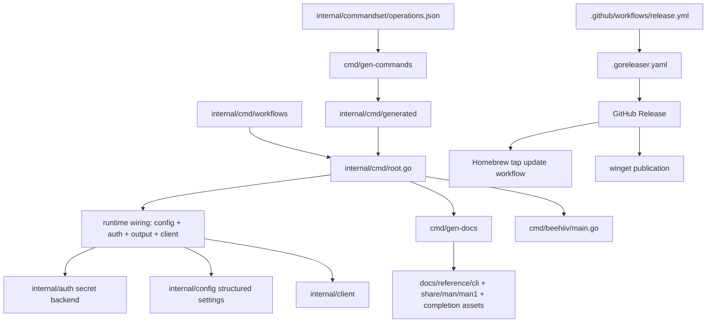
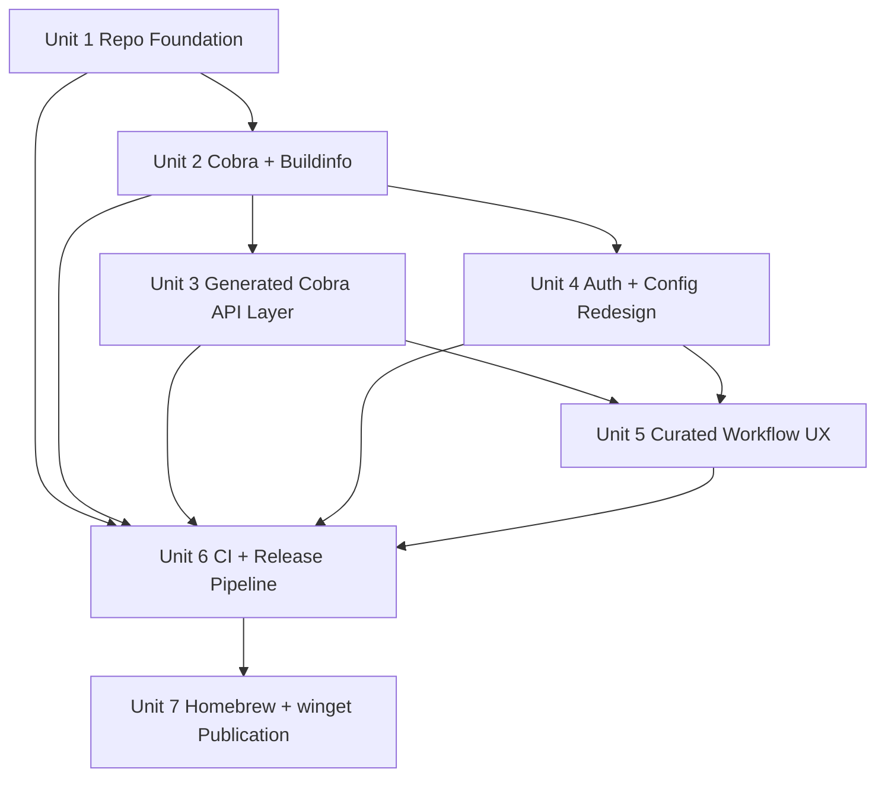

# refactor: Public Cobra Release Foundation

## Overview

Replatform `beehiiv-cli` from its current custom parser into a public, cross-platform Cobra-based CLI with a mature repository surface, secure default auth storage, generated docs/completions, and automated GitHub Release, Homebrew, and winget distribution.

The current repo already has a useful core: `internal/commandset/operations.json` contains 71 Beehiiv operations, the HTTP client/runtime logic is real, and the unit suite currently passes. The work is to harden and reorganize that core so it can support a stable public contract and a release/distribution lifecycle comparable to mature Go CLIs. This plan stays inside the agreed scope from the origin document and intentionally avoids adding unrelated product surface.

## Problem Frame

The current codebase is a promising internal-style CLI, but the public-facing layers are still thin. The parser, auth model, docs story, repo hygiene, release automation, and package-manager support are all too bespoke or incomplete for a confident open-source launch (see origin: `docs/brainstorms/2026-04-02-beehiiv-cli-open-source-maturity-requirements.md`).

This plan turns the existing implementation into a sustainable public CLI by:
- preserving the working Beehiiv API/runtime core where possible
- replacing the command framework with Cobra so help, versioning, completions, docs, and discoverability are standard
- separating secrets from non-secret config and defaulting to OS keychain/keyring storage
- formalizing build, CI, release, and package publication workflows
- layering curated workflow commands on top of broad generated API coverage instead of choosing one or the other

## Requirements Trace

- R1-R3. Add the public repository, contributor, and automation surface required for open source.
- R4-R10. Replatform the CLI onto Cobra, keep JSON-first behavior, generate docs/completions, and refactor the architecture into clearer subsystems.
- R11-R13. Move credentials to secure default storage while keeping headless env-based auth and mostly pure-Go cross-platform builds.
- R14-R17. Add cross-platform CI, GitHub Release automation, Homebrew + winget distribution, version metadata, and release integrity artifacts.
- R18-R19. Mature the codebase and test topology so the public launch is intentionally organized rather than a code drop.

## Scope Boundaries

- No Chocolatey, Scoop, or extra Linux package managers in the initial release.
- No requirement to preserve the current pre-release command and output contract if cleanup improves the public v1 surface.
- No requirement to match `gh`, `stripe-cli`, `aws-cli`, or `gogcli` feature-for-feature; they are design and process references, not parity targets.
- No platform signing or notarization requirement for day one unless implementation research proves it is cheap and low-risk; checksums and GitHub attestations are the integrity baseline.
- No new Beehiiv product capabilities beyond what is needed to make the CLI more usable, discoverable, secure, and releasable.

## Context & Research

### Relevant Code and Patterns

- `cmd/beehiiv/main.go` already follows the desirable thin-entrypoint shape and can stay minimal after the Cobra migration.
- `internal/commandset/operations.json` and `internal/commandset/registry.go` are the strongest existing source of truth for broad API coverage and should remain the metadata spine for generated commands.
- `internal/client/client.go` already centralizes request execution, rate limiting, retry behavior, timeout handling, and verbose tracing; this should be preserved as the runtime API layer rather than rewritten.
- `internal/config/config.go` already captures useful config precedence and OS-specific path handling, but it currently mixes secret and non-secret concerns around a plaintext `.env`.
- `internal/cli/app_test.go` provides a good characterization baseline for root help, auth flows, output modes, and request behavior. Those expectations should be migrated, not discarded.
- `internal/client/live_test.go` and `internal/testsupport/live.go` show an existing split between unit tests and gated live Beehiiv validation; the public test strategy should keep that distinction.

### Institutional Learnings

- No `docs/solutions/` artifacts currently exist in this repo, so the plan should lean on verified local code patterns and official external docs rather than inventing team conventions that are not yet documented.

### External References

- Official Cobra docs: command initialization, default help/version/completion commands, `RunE`, suggestions, completion hooks, and generated docs/manpages.
- Official GoReleaser docs: winget publication, predictable checksum naming, and GitHub artifact attestations; current docs also note that GoReleaser Homebrew formula support is deprecated, which materially affects the Homebrew design.
- Reference repo patterns:
  - `gh`: dedicated Homebrew bump workflow and strong release separation
  - `stripe-cli`: package-manager install-test workflow and multi-platform release posture
  - `gogcli`: Makefile-driven local workflow, build metadata embedding, and `.githooks` pattern

## Key Technical Decisions

- **Cobra becomes the public command framework:** The new root command tree will live under `internal/cmd/` and own help, version, completion, and doc generation behavior because Cobra provides official support for those public CLI surfaces with less custom infrastructure than the current parser (see origin).
- **Generated coverage stays, but moves behind Cobra:** `internal/commandset/operations.json` remains the source of truth for low-level Beehiiv API coverage, while a generator emits Cobra command registrations and help metadata. This avoids a manual rewrite of 71 operations and preserves broad surface area.
- **Curated commands are first-class, not wrappers glued onto a raw API shell:** The public CLI will expose a curated layer for the most common workflows, implemented as hand-authored Cobra commands that sit alongside the generated low-level tree rather than inside it. This matches the hybrid direction chosen in the origin document.
- **Secrets and non-secret settings are split:** API keys move to a dedicated secret backend abstraction with OS keychain/keyring as the default implementation. Non-secret settings move to a structured config file. Environment variables remain highest-precedence for CI and scripts.
- **Release ownership is hybrid GitHub Actions plus GoReleaser:** GitHub Actions will orchestrate CI, tagging, release jobs, and attestations. GoReleaser will own archive production, checksums, build metadata, release artifacts, and winget publication. Homebrew will use a dedicated tap update workflow instead of deprecated GoReleaser formula automation.
- **Homebrew ships as a tap formula; winget ships as a portable package:** For the first public release, Homebrew should use a dedicated tap formula that points at GitHub Release tarballs, and winget should publish portable manifests targeting the released archive or executable. This keeps the initial distribution story cross-platform without forcing signed installers.
- **Checksums plus GitHub attestations are the day-one integrity baseline:** This meets the agreed maturity bar without front-loading notarization or signing complexity before the public launch proves itself.

## Open Questions

### Resolved During Planning

- **What command architecture should replace the current parser?** A staged Cobra migration rooted in `internal/cmd/` with thin `cmd/beehiiv/main.go` wiring and `RunE`-based error handling.
- **Should generated API coverage survive the replatform?** Yes. Keep `operations.json` as the metadata source and generate Cobra low-level commands from it instead of hand-porting each operation.
- **How should release automation be split?** GitHub Actions orchestrates; GoReleaser builds/publishes release artifacts and winget; Homebrew gets a separate tap update workflow because GoReleaser’s Homebrew formula flow is deprecated.
- **What distribution targets define v1?** GitHub Releases, Homebrew, and winget only.
- **What integrity posture is required for day one?** Predictable checksums and GitHub attestations; code signing and notarization are deferred unless they become cheap enough to justify within scope.

### Deferred to Implementation

- **Which specific Go keyring package should back the secret store?** The plan fixes the abstraction and expected behavior, but the exact library choice should be validated during implementation against cross-platform behavior and pure-Go constraints.
- **What is the final public module path and repository owner/name?** The repo currently uses `github.com/deldrid1/beehiiv-cli`; implementation should rename this once the final public GitHub location is known.
- **Which exact curated commands land in the first pass beyond auth and top README workflows?** The plan seeds a minimum curated surface, but the final breadth can be trimmed if migration complexity is higher than expected.

## High-Level Technical Design

> *This illustrates the intended approach and is directional guidance for review, not implementation specification. The implementing agent should treat it as context, not code to reproduce.*

## Phased Delivery

### Phase 1
- Establish repository foundation, local tooling, and version/build metadata.
- Introduce the Cobra root without forcing a big-bang rewrite of every command.

### Phase 2
- Migrate broad API coverage into generated Cobra commands.
- Redesign auth/config storage and land the first curated workflow layer.

### Phase 3
- Add cross-platform CI, release artifacts, docs/completions generation, and package publication.
- Validate install flows through GitHub Release, Homebrew, and winget.

## Implementation Units

- [ ] **Unit 1: Establish Public Repo Foundation**

**Goal:** Add the repository-level files, local workflow, and contributor ergonomics needed for open-source collaboration before deeper runtime refactors land.

**Requirements:** R1, R2, R3

**Dependencies:** None

**Files:**
- Create: `.editorconfig`
- Create: `.github/ISSUE_TEMPLATE/bug_report.yml`
- Create: `.github/ISSUE_TEMPLATE/feature_request.yml`
- Create: `.github/PULL_REQUEST_TEMPLATE.md`
- Create: `.github/dependabot.yml`
- Create: `.githooks/pre-commit`
- Create: `.golangci.yml`
- Create: `LICENSE`
- Create: `CODE_OF_CONDUCT.md`
- Create: `CONTRIBUTING.md`
- Create: `SECURITY.md`
- Create: `Makefile`
- Modify: `README.md`

**Approach:**
- Adopt a documented local workflow modeled after `gogcli`: stable build, format, lint, test, and doc-generation targets exposed through `Makefile`.
- Keep local hooks lightweight and advisory where possible so contributors are guided, not trapped.
- Update the README to reflect source builds, project maturity, and contribution expectations instead of manual binary movement instructions only.

**Patterns to follow:**
- `cmd/beehiiv/main.go` for the repo’s existing “thin entrypoint” sensibility
- `gogcli` Makefile and `.githooks/pre-commit` structure as maturity references
- `gh` issue and PR template style as a public-project reference

**Test scenarios:**
- Test expectation: none -- this unit is repository scaffolding and contributor workflow metadata rather than feature-bearing runtime code.

**Verification:**
- The repo contains the expected public-project documents and contributor workflow entry points.
- A contributor can identify how to build, lint, test, and contribute by reading `README.md` and `CONTRIBUTING.md`.

- [ ] **Unit 2: Introduce Cobra Root, Global Flags, and Build Metadata**

**Goal:** Replace the current one-struct parser entrypoint with a standard Cobra root command, version surface, completion command, and centralized runtime/build metadata wiring while keeping the implementation staged.

**Requirements:** R4, R5, R7, R8, R10, R17

**Dependencies:** Unit 1

**Files:**
- Create: `internal/buildinfo/buildinfo.go`
- Create: `internal/buildinfo/buildinfo_test.go`
- Create: `internal/cmd/root.go`
- Create: `internal/cmd/root_test.go`
- Create: `internal/cmd/version.go`
- Create: `internal/cmd/completion.go`
- Create: `internal/cmd/global_flags.go`
- Create: `internal/runtime/runtime.go`
- Create: `internal/runtime/runtime_test.go`
- Modify: `cmd/beehiiv/main.go`
- Modify: `go.mod`
- Modify: `README.md`
- Test: `internal/cmd/root_test.go`
- Test: `internal/buildinfo/buildinfo_test.go`
- Test: `internal/runtime/runtime_test.go`

**Approach:**
- Keep `cmd/beehiiv/main.go` minimal and move CLI construction into `internal/cmd/root.go`.
- Define global flags once in the Cobra root and thread them into runtime creation instead of letting parser logic own all behavior.
- Embed version, commit, and build date metadata through a dedicated `internal/buildinfo` package so release artifacts, `beehiiv version`, and debug output all draw from one source.
- Use Cobra defaults for help, version, and completion behavior, but explicitly configure error presentation with `SilenceUsage` and `SilenceErrors` so scripting output stays clean.
- Preserve current JSON-first expectations and legacy behavior through characterization tests while the deeper command migration is still underway.

**Execution note:** Add characterization coverage for current root help, output mode flags, and error formatting before fully retiring the custom parser.

**Patterns to follow:**
- Existing minimal entrypoint in `cmd/beehiiv/main.go`
- Cobra official guidance for root command execution, version surfaces, help, suggestions, and completions
- `gogcli` build metadata pattern as a reference for version/commit/date embedding

**Test scenarios:**
- Happy path: `beehiiv --help` renders the Cobra root help with command groups and global flags.
- Happy path: `beehiiv version` prints embedded version, commit, and build date when ldflags are present.
- Edge case: snapshot or local builds without git metadata fall back to deterministic development values instead of blank output.
- Error path: unknown commands return a non-zero exit code, show suggestions, and do not print noisy usage twice.
- Integration: `--output`, `--compact`, `--raw`, and `--verbose` global flags are accepted from the root and propagate into runtime behavior.
- Integration: `beehiiv completion <shell>` emits scripts for Bash, Zsh, Fish, and PowerShell from the same root command tree used at runtime.

**Verification:**
- The CLI boots through Cobra, exposes standard help/version/completion surfaces, and still supports the current output-mode contract during the migration window.

- [ ] **Unit 3: Generate the Low-Level Cobra Command Tree from Beehiiv Metadata**

**Goal:** Preserve broad Beehiiv API coverage by generating Cobra commands from `operations.json` while reusing the existing client/runtime logic and retiring the custom parser as command ownership shifts.

**Requirements:** R4, R6, R7, R8, R9, R10, R18, R19

**Dependencies:** Unit 2

**Files:**
- Create: `cmd/gen-commands/main.go`
- Create: `cmd/gen-docs/main.go`
- Create: `internal/cmd/generated/register.go`
- Create: `internal/cmd/generated/commands_gen.go`
- Create: `internal/cmd/generated/generated_test.go`
- Create: `internal/output/render.go`
- Create: `internal/output/render_test.go`
- Create: `docs/reference/cli/.gitkeep`
- Modify: `internal/commandset/registry.go`
- Modify: `internal/commandset/registry_test.go`
- Modify: `internal/client/client.go`
- Modify: `internal/cli/render.go`
- Modify: `internal/cli/app.go`
- Modify: `README.md`
- Test: `internal/cmd/generated/generated_test.go`
- Test: `internal/output/render_test.go`
- Test: `internal/commandset/registry_test.go`

**Approach:**
- Keep `internal/commandset/operations.json` as the metadata source of truth, but generate Cobra registration code and command help from it so runtime help, docs, and completions all share one tree.
- Move reusable rendering logic out of the legacy parser package into a stable output package that both generated and curated commands can call.
- Migrate parser-specific execution behavior into reusable runtime helpers so generated Cobra commands do not duplicate URL construction, request execution, query handling, pagination, or output rendering.
- Add a doc generator that renders markdown reference docs and manpages from the Cobra tree rather than hand-maintaining CLI docs.
- Retire `internal/cli/app.go` only after generated coverage reaches parity with the existing low-level command surface.

**Technical design:** Directional guidance only: the generator should emit command registration and argument/flag metadata, not hand-written runtime behavior. Each generated command should describe what to call; shared runtime packages should decide how to execute, paginate, and render.

**Patterns to follow:**
- `internal/commandset/registry.go` and `operations.json` as the existing source-of-truth model
- `internal/client/client.go` for request execution, retries, and tracing
- `internal/pagination/pagination.go` for `--all` behavior
- Cobra doc-generation and completion APIs from the official docs

**Test scenarios:**
- Happy path: a representative generated list command and get command register under Cobra and execute through the shared runtime without custom parser code.
- Happy path: generated markdown reference docs and manpages include the same flags, args, and help text as the live command tree.
- Edge case: repeatable query parameters and required path arguments are rendered and parsed correctly in generated commands.
- Edge case: list endpoints with `hybrid`, `cursor`, `offset`, and `none` pagination modes preserve existing behavior, including `--all`.
- Error path: missing required publication or path arguments fail with precise command-level errors instead of generic runtime panics.
- Integration: raw, json, and table output paths still work when commands are invoked through the generated Cobra tree.

**Verification:**
- The broad Beehiiv API surface is accessible from the Cobra tree with parity for representative commands.
- Docs and manpages can be regenerated from the live command tree without manual edits.

- [ ] **Unit 4: Redesign Auth, Secret Storage, and Config Migration**

**Goal:** Replace plaintext-default secret handling with a structured config plus keychain/keyring secret backend while keeping CI and scripting paths reliable.

**Requirements:** R5, R7, R11, R12, R13, R19

**Dependencies:** Unit 2

**Files:**
- Create: `internal/auth/store.go`
- Create: `internal/auth/store_test.go`
- Create: `internal/auth/keyring.go`
- Create: `internal/auth/keyring_test.go`
- Create: `internal/config/settings.go`
- Create: `internal/config/migrate.go`
- Create: `internal/config/migrate_test.go`
- Create: `internal/cmd/auth.go`
- Create: `internal/cmd/auth_login.go`
- Create: `internal/cmd/auth_status.go`
- Create: `internal/cmd/auth_logout.go`
- Modify: `internal/config/config.go`
- Modify: `internal/config/config_test.go`
- Modify: `internal/testsupport/live.go`
- Modify: `README.md`
- Test: `internal/auth/store_test.go`
- Test: `internal/auth/keyring_test.go`
- Test: `internal/config/migrate_test.go`

**Approach:**
- Split secrets from non-secret settings. Non-secret preferences such as publication ID, output defaults, or client settings belong in a structured config file. API keys belong in a dedicated secret store abstraction.
- Make OS keychain/keyring the default secret backend. Environment variables remain the highest-precedence non-interactive path for CI, scripting, and live tests.
- Replace `auth current` as a routine credential-printing surface with a safer `auth status` or equivalent summary that confirms backend, account state, and publication configuration without leaking secrets.
- Provide a migration path from the current `.env` model by importing or converting legacy values into the new backend on first login or first explicit migration flow, with a clear deprecation boundary.
- Keep the default runtime path mostly pure Go by treating the keyring implementation as an adapter behind an interface; if a chosen library introduces platform-specific tradeoffs, isolate them in this package.

**Patterns to follow:**
- Current precedence and OS-path handling in `internal/config/config.go`
- Current live-test env override behavior in `internal/testsupport/live.go`
- The security posture chosen in the origin document

**Test scenarios:**
- Happy path: login stores the API key in the secret backend and the selected publication in structured config, then subsequent commands load both successfully.
- Happy path: env vars override stored values for CI and one-off scripted runs without mutating persisted state.
- Edge case: systems without a usable keyring fail with a precise, actionable error rather than silently downgrading to insecure storage.
- Edge case: legacy `.env` data migrates once and preserves publication ID while removing the need for plaintext secret reads in normal operation.
- Error path: corrupted structured config or missing secret backend entries return user-facing errors that identify which layer is broken.
- Integration: live-test helpers continue to work via environment variables and do not require interactive keyring access.

**Verification:**
- The default local auth path uses secure storage for secrets, non-interactive env-based workflows still function, and no standard command prints live credentials by default.

- [ ] **Unit 5: Add the First Curated Workflow Layer and Public UX Polish**

**Goal:** Make the public command surface feel intentional by layering curated workflows and discoverability improvements on top of generated low-level coverage.

**Requirements:** R5, R6, R7, R8, R9, R18, R19

**Dependencies:** Units 3 and 4

**Files:**
- Create: `internal/cmd/workflows/publications.go`
- Create: `internal/cmd/workflows/subscriptions.go`
- Create: `internal/cmd/workflows/posts.go`
- Create: `internal/cmd/workflows/webhooks.go`
- Create: `internal/cmd/workflows/workflows_test.go`
- Modify: `internal/cmd/root.go`
- Modify: `README.md`
- Test: `internal/cmd/workflows/workflows_test.go`

**Approach:**
- Start with the workflows already emphasized by the current README and live tests: auth, publications, subscriptions, posts, and webhooks.
- Use curated commands and aliases to improve naming, examples, and discoverability without removing low-level generated access for the full Beehiiv API.
- Tighten public help text, examples, and table output so the CLI feels more like a designed product than a raw endpoint shim.
- Define the pre-v1 cleanup window here: rename or reorganize awkward command groups, flags, and help text while the contract is still allowed to move.

**Patterns to follow:**
- Current README examples for the most visible workflows
- `internal/client/live_test.go` for the workflows that already matter in practice
- Cobra examples/help patterns from the official docs

**Test scenarios:**
- Happy path: curated `publications`, `subscriptions`, `posts`, and `webhooks` commands resolve to working runtime flows and include clearer examples than the generated baseline.
- Happy path: aliases and shortcut paths for the curated commands appear in root help and shell completions.
- Edge case: curated commands preserve JSON-first scripting behavior when output is piped or `--output json` is selected.
- Error path: curated commands wrap low-level client failures with actionable command-specific context instead of leaking only operation IDs.
- Integration: the curated layer and generated layer coexist without conflicting names or duplicate registrations in the root command tree.

**Verification:**
- The public CLI offers a discoverable first-pass workflow surface while still retaining broad low-level Beehiiv coverage beneath it.

- [ ] **Unit 6: Build Cross-Platform CI and GitHub Release Artifact Pipeline**

**Goal:** Add reproducible cross-platform CI and tagged GitHub Release automation with build metadata, generated docs/completions, checksums, and GitHub attestations.

**Requirements:** R2, R3, R8, R9, R13, R14, R15, R17, R19

**Dependencies:** Units 1 through 5

**Files:**
- Create: `.github/workflows/ci.yml`
- Create: `.github/workflows/release.yml`
- Create: `.goreleaser.yaml`
- Create: `scripts/check-generated.sh`
- Create: `scripts/release-smoke.sh`
- Create: `scripts/release-notes.md.tmpl`
- Modify: `Makefile`
- Modify: `README.md`

**Approach:**
- Split CI and release concerns. CI should cover linting, unit tests, generated-artifact drift checks, and cross-platform build smoke coverage on macOS, Linux, and Windows.
- Release should run on semver tags, embed build metadata, generate archives for supported targets, publish checksums at a predictable filename, and attach GitHub attestations after artifact production.
- Generated reference docs, manpages, and completion assets should be produced from the live Cobra tree as part of the release flow so published artifacts and docs cannot drift.
- Keep this phase focused on reproducibility and clarity, not platform signing or installer complexity.

**Patterns to follow:**
- `gogcli` CI structure for Makefile-driven quality gates
- `stripe-cli` release and package-install test separation
- `gh` deployment workflow pattern for attestation and release orchestration
- Official GoReleaser docs for predictable checksum names and attestation integration

**Test scenarios:**
- Test expectation: none -- this unit is primarily workflow and release configuration; behavioral validation occurs through CI/release smoke checks rather than Go test files.

**Verification:**
- Pull requests run a consistent cross-platform quality gate.
- Semver tags produce GitHub Release artifacts with embedded metadata, generated docs/completions/manpages, and predictable checksums suitable for attestation verification.

- [ ] **Unit 7: Publish and Validate Homebrew and winget Distribution**

**Goal:** Turn GitHub Release artifacts into first-class Homebrew and winget install paths, with validation workflows that catch packaging regressions before users do.

**Requirements:** R14, R15, R16, R17, R19

**Dependencies:** Unit 6

**Files:**
- Create: `.github/workflows/homebrew-bump.yml`
- Create: `.github/workflows/package-install.yml`
- Create: `packaging/homebrew/beehiiv.rb.tmpl`
- Create: `packaging/winget/README.md`
- Create: `scripts/update-homebrew-tap.sh`
- Create: `scripts/install-test.sh`
- Modify: `.goreleaser.yaml`
- Modify: `README.md`

**Approach:**
- Treat Homebrew and winget as distinct publication paths with a shared artifact source.
- For Homebrew, update a dedicated tap formula from the release metadata rather than depending on deprecated GoReleaser formula support.
- For winget, use GoReleaser-managed manifest generation or a release-coupled manifest update path that opens or updates the required publication change against the winget manifest repository.
- Add install-validation workflows that exercise the distributed artifacts through Homebrew and winget paths, modeled after `stripe-cli` package install tests, so packaging failures are caught by automation.
- Document the external credentials, repository permissions, and maintainer steps required for both publication paths.

**Patterns to follow:**
- `gh` Homebrew bump workflow pattern
- `stripe-cli` package-manager install-test workflow
- Official GoReleaser winget documentation

**Test scenarios:**
- Test expectation: none -- this unit is release/publication plumbing. Validation should happen through package-manager install workflows and manifest checks rather than Go unit tests.

**Verification:**
- A release can update the Homebrew tap and winget publication path from the same GitHub Release metadata.
- Package-install validation exercises both distribution paths before maintainers consider the release complete.

## System-Wide Impact

- **Interaction graph:** The Cobra root becomes the public command surface; generated and curated commands both feed shared runtime services; auth/config/output/client packages become reusable dependencies rather than parser-owned behavior.
- **Error propagation:** Command-level `RunE` handlers should translate runtime and auth failures into stable, user-facing errors without reintroducing verbose usage spam or leaking secrets.
- **State lifecycle risks:** Auth migration introduces state movement between legacy `.env`, structured config, and keychain storage; release automation introduces state across generated docs, archives, package manifests, and external tap/manifests.
- **API surface parity:** The generated command layer must preserve low-level Beehiiv endpoint reach even as curated commands reorganize the public surface.
- **Integration coverage:** Cross-layer confidence depends on root-command tests, generated-command parity tests, live Beehiiv smoke coverage, release artifact smoke checks, and package-manager install validation.
- **Unchanged invariants:** `internal/client`, `internal/pagination`, and `internal/ratelimit` should remain the runtime core unless specific tests show they need behavior changes. The goal is to reorganize ownership and public surface, not rewrite stable request behavior for its own sake.

## Alternative Approaches Considered

- **Big-bang rewrite of the entire CLI into hand-authored Cobra commands:** Rejected because it would discard the strongest existing asset, the operation metadata/registry, and create unnecessary parity risk across 71 commands.
- **Keep the custom parser and only add release/repo plumbing:** Rejected because it would leave public help, docs, completion, and discoverability tied to bespoke infrastructure that Cobra already solves well.
- **Use GoReleaser alone for both Homebrew and winget publication:** Rejected because current GoReleaser docs deprecate Homebrew formulas, while winget remains a strong fit.
- **Keep plaintext `.env` as the default secret path with docs warnings:** Rejected because it conflicts with the chosen public security posture.

## Success Metrics

- The public CLI boots from Cobra, exposes standard `help`, `version`, and `completion` surfaces, and generates reference docs from the same command tree.
- A contributor can discover and run the local workflow through repo docs and `Makefile` targets without tribal knowledge.
- A semver tag produces reproducible GitHub Release artifacts with checksums and attestations.
- Homebrew and winget install paths are maintained and validated from the release pipeline.
- Auth defaults no longer store secrets in plaintext or print them during normal status flows.

## Dependencies / Prerequisites

- A real git repository and intended public GitHub location must exist before release workflows, package publication, and module path cleanup can be finalized.
- Homebrew tap repository access and winget publication permissions must be available to the maintainers implementing Unit 7.
- The final public project name and module path must be chosen before the release contract is frozen at v1.

## Risks & Dependencies

| Risk | Mitigation |
|------|------------|
| Cobra migration breaks existing command behavior before parity is established | Characterize current help/output/auth flows first, stage generated migration through shared runtime helpers, and retire parser code only after representative parity tests pass |
| Secret-storage redesign regresses CI or headless automation | Keep env vars as highest-precedence non-interactive auth, isolate the secret backend behind an interface, and preserve live-test env behavior throughout migration |
| Generated and curated command trees diverge or conflict | Keep `operations.json` as the low-level source of truth, register curated commands separately, and add registration conflict tests |
| Release pipeline becomes tightly coupled to deprecated Homebrew automation | Use GoReleaser for release artifacts and winget only; manage Homebrew tap updates through a dedicated workflow modeled after `gh` |
| Package publication requires more maintainer access than expected | Document prerequisites explicitly and keep package publication in the final phase after GitHub Release artifacts are already stable |

## Documentation Plan

- Update `README.md` to reflect the new install paths, auth model, version surface, and curated workflows.
- Generate command reference docs into `docs/reference/cli/` from the Cobra tree.
- Generate manpages during release and publish them with release artifacts.
- Document contributor workflow, security reporting, and package-manager release prerequisites in repo docs.

## Operational / Rollout Notes

- Freeze the public v1 command contract only after Units 2 through 5 land and the curated surface has been reviewed.
- Treat the first release candidate as a dry run for GitHub Release, Homebrew tap update, and winget publication before announcing broadly.
- Keep live Beehiiv smoke tests gated and opt-in so the default CI signal stays fast and reliable.

## Sources & References

- **Origin document:** `docs/brainstorms/2026-04-02-beehiiv-cli-open-source-maturity-requirements.md`
- Related code:
  - `cmd/beehiiv/main.go`
  - `internal/commandset/operations.json`
  - `internal/commandset/registry.go`
  - `internal/client/client.go`
  - `internal/config/config.go`
  - `internal/cli/app_test.go`
  - `internal/client/live_test.go`
  - `internal/testsupport/live.go`
- External docs:
  - https://pkg.go.dev/github.com/spf13/cobra
  - https://goreleaser.com/customization/winget/
  - https://goreleaser.com/customization/publish/attestations/
  - https://goreleaser.com/customization/publish/homebrew_formulas/
- Reference repos:
  - https://github.com/cli/cli
  - https://github.com/stripe/stripe-cli
  - https://github.com/steipete/gogcli
